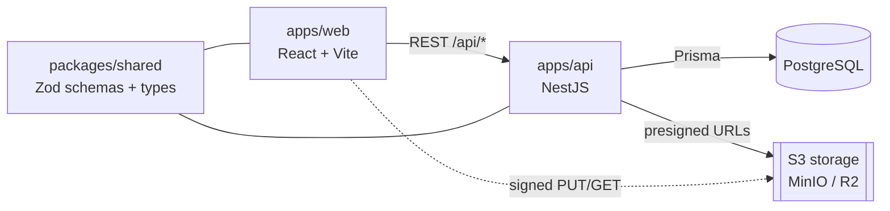

<div align="center">


### A day-centric personal hub — tasks, goals, notes, events and contacts, all interlinked.

Full-stack **TypeScript** application: React + NestJS in a typed monorepo, with a design system built around one idea — _daylight, calm focus._

[](https://github.com/amaroAdonis/daily-hub/actions/workflows/ci.yml)


**[🚀 Live demo](https://daily-hub.up.railway.app)** · **[API docs (Swagger)](https://daily-hub-api.up.railway.app/api/docs)**

<sub>🇬🇧 English · <a href="README.pt-BR.md">🇧🇷 Português</a></sub>

</div>

---

## Overview

Most personal-productivity tools live in silos: the to-do app doesn't know about the calendar, the note doesn't know about the person it mentions. **Daily Hub** puts the **day** at the center and lets _any_ item link to _any_ other — a task to a goal, a note to a contact, an attachment to an event — through one polymorphic layer.

It's also a deliberate engineering showcase: a separate React front-end and NestJS API talking over a documented REST contract, with a single source of truth for data shapes (Zod) shared across the boundary.

## Highlights

- **The day as a hub.** The calendar is the landing page; opening a day reveals a rich dashboard (agenda by time-of-day, tasks, notes and the people linked to that day).
- **Everything interlinked.** A polymorphic `EntityLink` + `Tagging` layer connects any two entities, surfaced through a uniform "Connections" inspector and global search (⌘K).
- **End-to-end type safety.** Zod schemas in `packages/shared` validate the API _and_ type the client — from the database edge to the UI, validation lives in one place.
- **A real design system.** Tokens (color, type, elevation, motion) in CSS variables, a unified status model across the three item types, accessible by default (visible focus, `prefers-reduced-motion`), purposeful motion with Framer Motion — and a conscious effort to avoid AI-generated UI clichés.
- **Non-trivial domain logic.** RRULE recurrence expanded into occurrences, presigned-URL uploads to S3-compatible storage, JWT auth (argon2) with a global guard, and a unified Kanban (`@dnd-kit`) that drives status across tasks, events and goals.
- **Documented like a product.** Every feature has requirements (`REQ-*`) and acceptance criteria (`AC-*`), architecture decisions are logged (`DECISIONS.md`), and the whole thing builds into a MkDocs site.

## Tech stack

| Layer          | Technology                                                                      |
| -------------- | ------------------------------------------------------------------------------- |
| Monorepo       | pnpm workspaces + Turborepo                                                     |
| Frontend       | React + Vite + TypeScript, TanStack Query, Tailwind CSS, Framer Motion, dnd-kit |
| Backend        | NestJS (one module per feature), Swagger/OpenAPI                                |
| Validation     | Zod — schemas shared in `packages/shared`                                       |
| Database / ORM | PostgreSQL + Prisma (`packages/db`)                                             |
| Storage        | S3-compatible (MinIO local · Cloudflare R2 in prod)                             |
| Tests          | Vitest (unit/integration), Playwright (e2e — planned)                           |
| Quality        | ESLint, Prettier, Husky, Commitlint, GitHub Actions                             |

## Architecture



Front-end and back-end are **separate apps** (not a Next.js monolith) — a deliberate choice to show explicit API design and a clean boundary. Both are organized **by feature** and mirror each other. See [`docs/ARCHITECTURE.md`](docs/ARCHITECTURE.md) and [`docs/DECISIONS.md`](docs/DECISIONS.md).

## Features

Tasks · Calendar/Agenda · Events (with recurrence) · Goals (with sub-goals) · Notes (Markdown) · Contacts · **Integration** (links, tags, global search) · Auth + Profile · Day dashboard · Attachments · Kanban.

Each feature is fully specified in [`docs/features/`](docs/features/INDEX.md) — overview, business rules, flows (Mermaid) and technical notes.

## Getting started

**Prerequisites:** Node.js ≥ 20.11 · pnpm 9 · Docker (for Postgres + MinIO).

```bash
pnpm install                 # install dependencies
cp .env.example .env         # environment variables
docker compose up -d         # Postgres + MinIO
pnpm db:generate             # generate the Prisma client
pnpm db:migrate              # create the tables
pnpm db:seed                 # (optional) sample data
pnpm dev                     # web + api in watch mode
```

- Web → http://localhost:5173
- API → http://localhost:3333/api
- API docs (Swagger) → http://localhost:3333/api/docs

| Command                                      | What it does                  |
| -------------------------------------------- | ----------------------------- |
| `pnpm dev`                                   | Run web and api in watch mode |
| `pnpm build`                                 | Build all packages            |
| `pnpm lint` · `pnpm typecheck` · `pnpm test` | Quality gates                 |
| `pnpm db:studio`                             | Open Prisma Studio            |

## Documentation

The docs follow a folder-per-feature standard and build into a **MkDocs Material** site.

| Doc                                                     | Content                                |
| ------------------------------------------------------- | -------------------------------------- |
| [Project Brief](docs/PROJECT_BRIEF.md)                  | Vision, audience, goals, non-goals     |
| [Architecture](docs/ARCHITECTURE.md)                    | Monorepo, packages, data flow          |
| [Data model](docs/data-model.md)                        | Entities, ER and the linking layer     |
| [Decisions](docs/DECISIONS.md)                          | Architecture decision records (`D00N`) |
| [Design system](docs/design-system/index.md)            | Tokens, principles, components         |
| [Features](docs/features/INDEX.md)                      | Per-feature specs (`REQ-*` / `AC-*`)   |
| [Roadmap](docs/ROADMAP.md) · [Backlog](docs/BACKLOG.md) | Plan and prioritized work              |

Serve the docs site locally: `pipx run --spec mkdocs-material mkdocs serve` → http://127.0.0.1:8000

## Project status

**Phases 0–12 complete** — all features plus a live deployment on **[daily-hub.up.railway.app](https://daily-hub.up.railway.app)** (Railway: web + API + Postgres; Cloudflare R2 for attachments). See the [roadmap](docs/ROADMAP.md).

## Author

Built by **Amaro Adonis**, with a focus on front-end craft. _Personal project — not licensed for reuse._
