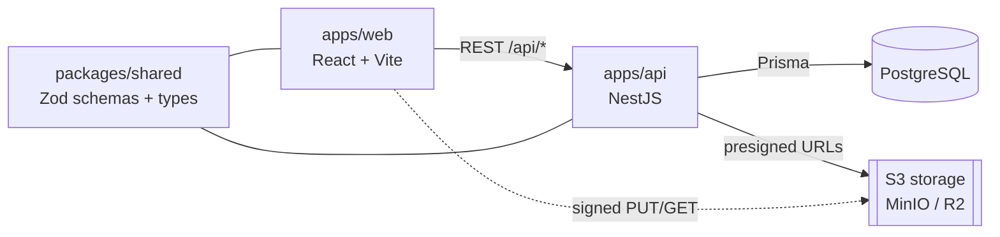

<div align="center">


### A day-centric personal hub — tasks, goals, notes, events and contacts, all interlinked.

Full-stack **TypeScript** in a typed monorepo (React + NestJS), with a design system built around one idea — _daylight, calm focus._

[](https://github.com/amaroAdonis/daily-hub/actions/workflows/ci.yml)


**[🚀 Live demo](https://daily-hub.up.railway.app)** · **[API docs (Swagger)](https://daily-hub-api.up.railway.app/api/docs)** · **[Documentation](docs/PROJECT_BRIEF.md)**

<sub>🇬🇧 English · <a href="README.pt-BR.md">🇧🇷 Português</a></sub>

</div>

---

## Overview

Personal-productivity tools tend to live in silos: the to-do app doesn't know about the calendar, and the note doesn't know about the person it mentions. **Daily Hub** puts the **day** at the center and lets _any_ item link to _any_ other — a task to a goal, a note to a contact, an attachment to an event — through a single polymorphic layer.

Under the hood, a React front-end and a NestJS API talk over a documented REST contract, with one source of truth for data shapes (Zod) shared across the boundary — type safety from the database edge all the way to the UI.

## Features

| Feature            | Description                                                                                                                     |
| ------------------ | ------------------------------------------------------------------------------------------------------------------------------- |
| **Day dashboard**  | The calendar is the landing page; opening a day gives an agenda by time-of-day, inline CRUD, and the people linked to that day. |
| **Tasks**          | Daily to-dos with priority, a shared status axis and optional links to goals.                                                   |
| **Calendar**       | Month / week / day views that aggregate everything happening on a date.                                                         |
| **Events**         | Appointments with location and **RRULE** recurrence, expanded into occurrences.                                                 |
| **Goals**          | Objectives with progress, sub-goals and linked tasks.                                                                           |
| **Notes**          | Markdown notes, pinnable and attachable to a day.                                                                               |
| **Contacts**       | People, searchable and linkable to other items.                                                                                 |
| **Integration**    | Polymorphic links + tags between any entities, a "Connections" inspector and global search (⌘K).                                |
| **Auth & profile** | Email/password auth (argon2 + JWT), per-user data isolation, editable profile.                                                  |
| **Attachments**    | Files on tasks, events and notes via presigned-URL uploads to S3-compatible storage.                                            |
| **Kanban**         | A unified board that drives status (To do / Doing / Done) across tasks, events and goals.                                       |

Each feature is fully specified in [`docs/features/`](docs/features/INDEX.md) — overview, business rules, flows (Mermaid) and technical notes.

## Highlights

- **End-to-end type safety** — Zod schemas in `packages/shared` validate the API _and_ type the client; validation lives in exactly one place.
- **A real design system** — tokens (color, type, elevation, motion) as CSS variables, a unified status model, purposeful motion (Framer Motion), and accessibility by default (visible focus, `prefers-reduced-motion`).
- **Non-trivial domain logic** — RRULE recurrence, presigned-URL uploads, a global JWT guard, and drag-and-drop status across three entity types (`@dnd-kit`).
- **Documented like a product** — requirements (`REQ-*`) and acceptance criteria (`AC-*`) per feature, logged architecture decisions, and a MkDocs site.

## Tech stack

| Layer          | Technology                                                                      |
| -------------- | ------------------------------------------------------------------------------- |
| Monorepo       | pnpm workspaces + Turborepo                                                     |
| Frontend       | React + Vite + TypeScript, TanStack Query, Tailwind CSS, Framer Motion, dnd-kit |
| Backend        | NestJS (one module per feature), Swagger/OpenAPI                                |
| Validation     | Zod — schemas shared in `packages/shared`                                       |
| Database / ORM | PostgreSQL + Prisma (`packages/db`)                                             |
| Storage        | S3-compatible (MinIO local · Cloudflare R2 in prod)                             |
| Tooling        | Vitest, ESLint, Prettier, Husky, Commitlint, GitHub Actions                     |

## Architecture



Front-end and back-end are **separate apps** (not a Next.js monolith) — a deliberate choice for explicit API design and a clean boundary. Both are organized **by feature** and mirror each other. See [`docs/ARCHITECTURE.md`](docs/ARCHITECTURE.md) and [`docs/DECISIONS.md`](docs/DECISIONS.md).

```
daily-hub/
├─ apps/
│  ├─ web/        # React + Vite front-end
│  └─ api/        # NestJS API
├─ packages/
│  ├─ db/         # Prisma schema + client
│  ├─ shared/     # Zod schemas and shared types
│  └─ config/     # shared tsconfig presets
└─ docs/          # product & engineering docs (MkDocs)
```

## Getting started

**Prerequisites:** Node.js ≥ 20.11 · pnpm 9 · Docker (Postgres + MinIO).

```bash
pnpm install                 # install dependencies
cp .env.example .env         # environment variables
docker compose up -d         # Postgres + MinIO
pnpm db:generate             # generate the Prisma client
pnpm db:migrate              # create the tables
pnpm db:seed                 # (optional) sample data
pnpm dev                     # web + api in watch mode
```

Web → `localhost:5173` · API → `localhost:3333/api` · Swagger → `localhost:3333/api/docs`

| Command                                      | What it does                  |
| -------------------------------------------- | ----------------------------- |
| `pnpm dev`                                   | Run web and api in watch mode |
| `pnpm build`                                 | Build all packages            |
| `pnpm lint` · `pnpm typecheck` · `pnpm test` | Quality gates                 |
| `pnpm db:studio`                             | Open Prisma Studio            |

## Documentation

Docs follow a folder-per-feature standard and build into a **MkDocs Material** site (`pipx run --spec mkdocs-material mkdocs serve`).

| Doc                                                     | Content                                |
| ------------------------------------------------------- | -------------------------------------- |
| [Project Brief](docs/PROJECT_BRIEF.md)                  | Vision, audience, goals, non-goals     |
| [Architecture](docs/ARCHITECTURE.md)                    | Monorepo, packages, data flow          |
| [Data model](docs/data-model.md)                        | Entities, ER and the linking layer     |
| [Decisions](docs/DECISIONS.md)                          | Architecture decision records (`D00N`) |
| [Design system](docs/design-system/index.md)            | Tokens, principles, components         |
| [Features](docs/features/INDEX.md)                      | Per-feature specs (`REQ-*` / `AC-*`)   |
| [Roadmap](docs/ROADMAP.md) · [Backlog](docs/BACKLOG.md) | Plan and prioritized work              |

## Deployment

Live on [**daily-hub.up.railway.app**](https://daily-hub.up.railway.app) — Railway runs the web, API and PostgreSQL; Cloudflare R2 holds attachments. Each service builds from its own multi-stage Dockerfile and runs `prisma migrate deploy` on start. Details in [`docs/deploy.md`](docs/deploy.md).

## Author

Built by **Amaro Adonis**, with a focus on front-end craft. _Personal project — not licensed for reuse._
