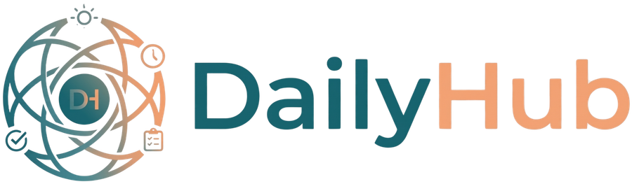
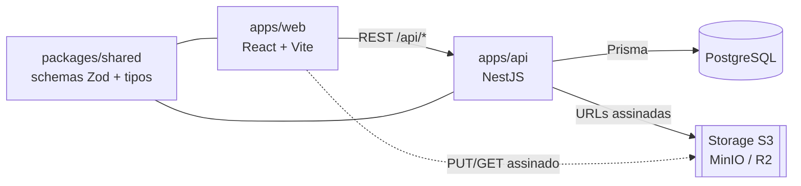

<div align="center">



### Uma central pessoal centrada no dia — tarefas, metas, anotações, compromissos e contatos, todos interligados.

Projeto de portfólio full-stack **TypeScript**: React + NestJS num monorepo tipado, com um design system construído sobre uma ideia — _luz do dia, foco calmo._

[](https://github.com/amaroAdonis/daily-hub/actions/workflows/ci.yml)


**[🚀 Demo ao vivo](https://daily-hub.up.railway.app)** · **[Docs da API (Swagger)](https://daily-hub-api.up.railway.app/api/docs)**

<sub><a href="README.md">🇬🇧 English</a> · 🇧🇷 Português</sub>

</div>

---

## Visão geral

A maioria das ferramentas de produtividade vive em silos: o app de tarefas não conhece o calendário, a nota não conhece a pessoa que ela menciona. O **Daily Hub** coloca o **dia** no centro e deixa _qualquer_ item se ligar a _qualquer_ outro — uma tarefa a uma meta, uma nota a um contato, um anexo a um compromisso — por meio de uma única camada polimórfica.

É também uma vitrine de engenharia deliberada: um front-end React e uma API NestJS separados, conversando por um contrato REST documentado, com uma fonte única de verdade para a forma dos dados (Zod) compartilhada na fronteira.

## Destaques

- **O dia como hub.** O calendário é a landing page; abrir um dia revela um dashboard rico (agenda por períodos, tarefas, notas e as pessoas vinculadas àquele dia).
- **Tudo interligado.** Uma camada polimórfica de `EntityLink` + `Tagging` conecta quaisquer duas entidades, exposta por um Inspetor de "Conexões" uniforme e pela busca global (⌘K).
- **Type-safety de ponta a ponta.** Schemas Zod em `packages/shared` validam a API _e_ tipam o cliente — da borda do banco à UI, a validação vive num só lugar.
- **Um design system de verdade.** Tokens (cor, tipografia, elevação, movimento) em CSS variables, um modelo de status unificado entre os três tipos de item, acessível por padrão (foco visível, `prefers-reduced-motion`), movimento com propósito via Framer Motion — e um esforço consciente para evitar clichês de UI gerada por IA.
- **Lógica de domínio não-trivial.** Recorrência RRULE expandida em ocorrências, upload por URL assinada para storage S3-compatível, auth JWT (argon2) com guard global e um Kanban unificado (`@dnd-kit`) que controla o status de tarefas, compromissos e metas.
- **Documentado como produto.** Cada feature tem requisitos (`REQ-*`) e critérios de aceite (`AC-*`), as decisões de arquitetura são registradas (`DECISIONS.md`) e tudo compila num site MkDocs.

## Stack

| Camada      | Tecnologia                                                                      |
| ----------- | ------------------------------------------------------------------------------- |
| Monorepo    | pnpm workspaces + Turborepo                                                     |
| Frontend    | React + Vite + TypeScript, TanStack Query, Tailwind CSS, Framer Motion, dnd-kit |
| Backend     | NestJS (um módulo por feature), Swagger/OpenAPI                                 |
| Validação   | Zod — schemas compartilhados em `packages/shared`                               |
| Banco / ORM | PostgreSQL + Prisma (`packages/db`)                                             |
| Storage     | S3-compatível (MinIO local · Cloudflare R2 em produção)                         |
| Testes      | Vitest (unit/integração), Playwright (e2e — planejado)                          |
| Qualidade   | ESLint, Prettier, Husky, Commitlint, GitHub Actions                             |

## Arquitetura



Front-end e back-end são **apps separados** (não um monolito Next.js) — escolha deliberada para mostrar design de API explícito e uma fronteira limpa. Ambos são organizados **por feature** e se espelham. Ver [`docs/ARCHITECTURE.md`](docs/ARCHITECTURE.md) e [`docs/DECISIONS.md`](docs/DECISIONS.md).

## Features

Tarefas · Calendário/Agenda · Compromissos (com recorrência) · Metas (com sub-metas) · Anotações (Markdown) · Contatos · **Integração** (links, tags, busca global) · Autenticação + Perfil · Dashboard do dia · Anexos · Kanban.

Cada feature é especificada em [`docs/features/`](docs/features/INDEX.md) — visão geral, regras de negócio, fluxos (Mermaid) e notas técnicas.

## Como rodar

**Pré-requisitos:** Node.js ≥ 20.11 · pnpm 9 · Docker (para Postgres + MinIO).

```bash
pnpm install                 # instala dependências
cp .env.example .env         # variáveis de ambiente
docker compose up -d         # Postgres + MinIO
pnpm db:generate             # gera o Prisma Client
pnpm db:migrate              # cria as tabelas
pnpm db:seed                 # (opcional) dados de exemplo
pnpm dev                     # web + api em watch
```

- Web → http://localhost:5173
- API → http://localhost:3333/api
- Docs da API (Swagger) → http://localhost:3333/api/docs

| Comando                                      | O que faz                    |
| -------------------------------------------- | ---------------------------- |
| `pnpm dev`                                   | Sobe web e api em modo watch |
| `pnpm build`                                 | Build de todos os pacotes    |
| `pnpm lint` · `pnpm typecheck` · `pnpm test` | Portões de qualidade         |
| `pnpm db:studio`                             | Abre o Prisma Studio         |

## Documentação

A documentação segue um padrão folder-per-feature e compila num site **MkDocs Material**.

| Doc                                                     | Conteúdo                                     |
| ------------------------------------------------------- | -------------------------------------------- |
| [Project Brief](docs/PROJECT_BRIEF.md)                  | Visão, público, objetivos, não-objetivos     |
| [Arquitetura](docs/ARCHITECTURE.md)                     | Monorepo, pacotes, fluxo de dados            |
| [Modelo de dados](docs/data-model.md)                   | Entidades, ER e a camada de links            |
| [Decisões](docs/DECISIONS.md)                           | Registros de decisão de arquitetura (`D00N`) |
| [Design system](docs/design-system/index.md)            | Tokens, princípios, componentes              |
| [Features](docs/features/INDEX.md)                      | Specs por feature (`REQ-*` / `AC-*`)         |
| [Roadmap](docs/ROADMAP.md) · [Backlog](docs/BACKLOG.md) | Plano e trabalho priorizado                  |

Servir o site da doc localmente: `pipx run --spec mkdocs-material mkdocs serve` → http://127.0.0.1:8000

## Status do projeto

**Fases 0–12 concluídas** — todas as features e um deploy ao vivo em **[daily-hub.up.railway.app](https://daily-hub.up.railway.app)** (Railway: web + API + Postgres; Cloudflare R2 para anexos). Ver o [roadmap](docs/ROADMAP.md).

## Autor

Feito por **Amaro Adonis** como projeto de portfólio full-stack, com foco em craft de front-end. _Projeto pessoal — sem licença para reúso._
