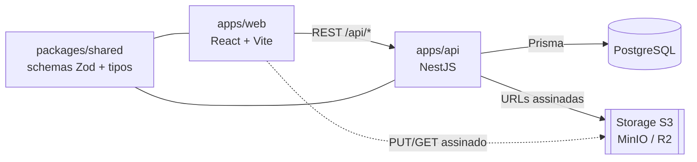

<div align="center">


### Uma central pessoal centrada no dia — tarefas, metas, anotações, compromissos e contatos, todos interligados.

Full-stack **TypeScript** num monorepo tipado (React + NestJS), com um design system construído sobre uma ideia — _luz do dia, foco calmo._

[](https://github.com/amaroAdonis/daily-hub/actions/workflows/ci.yml)


**[🚀 Demo ao vivo](https://daily-hub.up.railway.app)** · **[Docs da API (Swagger)](https://daily-hub-api.up.railway.app/api/docs)** · **[Documentação](docs/PROJECT_BRIEF.md)**

<sub><a href="README.md">🇬🇧 English</a> · 🇧🇷 Português</sub>

</div>

---

## Visão geral

Ferramentas de produtividade pessoal costumam viver em silos: o app de tarefas não conhece o calendário, e a nota não conhece a pessoa que ela menciona. O **Daily Hub** coloca o **dia** no centro e deixa _qualquer_ item se ligar a _qualquer_ outro — uma tarefa a uma meta, uma nota a um contato, um anexo a um compromisso — por meio de uma única camada polimórfica.

Nos bastidores, um front-end React e uma API NestJS conversam por um contrato REST documentado, com uma fonte única de verdade para a forma dos dados (Zod) compartilhada na fronteira — type safety da borda do banco até a UI.

## Funcionalidades

| Funcionalidade       | Descrição                                                                                                                     |
| -------------------- | ----------------------------------------------------------------------------------------------------------------------------- |
| **Dashboard do dia** | O calendário é a porta de entrada; abrir um dia traz uma agenda por períodos, CRUD inline e as pessoas vinculadas àquele dia. |
| **Tarefas**          | Atividades do dia com prioridade, eixo de status comum e vínculo opcional a metas.                                            |
| **Calendário**       | Visões mês / semana / dia que agregam tudo que acontece numa data.                                                            |
| **Compromissos**     | Eventos com local e recorrência **RRULE**, expandidos em ocorrências.                                                         |
| **Metas**            | Objetivos com progresso, sub-metas e tarefas vinculadas.                                                                      |
| **Anotações**        | Notas em Markdown, fixáveis e anexáveis a um dia.                                                                             |
| **Contatos**         | Pessoas, com busca e vínculo a outros itens.                                                                                  |
| **Integração**       | Links + tags polimórficos entre quaisquer entidades, Inspetor de "Conexões" e busca global (⌘K).                              |
| **Auth & perfil**    | Autenticação e-mail/senha (argon2 + JWT), isolamento de dados por usuário, perfil editável.                                   |
| **Anexos**           | Arquivos em tarefas, compromissos e notas via upload por URL assinada (storage S3-compatível).                                |
| **Kanban**           | Quadro unificado que controla o status (A fazer / Em andamento / Concluído) de tarefas, compromissos e metas.                 |

Cada funcionalidade é especificada em [`docs/features/`](docs/features/INDEX.md) — visão geral, regras de negócio, fluxos (Mermaid) e notas técnicas.

## Destaques

- **Type-safety de ponta a ponta** — schemas Zod em `packages/shared` validam a API _e_ tipam o cliente; a validação vive num único lugar.
- **Um design system de verdade** — tokens (cor, tipografia, elevação, movimento) em CSS variables, modelo de status unificado, movimento com propósito (Framer Motion) e acessibilidade por padrão (foco visível, `prefers-reduced-motion`).
- **Lógica de domínio não-trivial** — recorrência RRULE, upload por URL assinada, guard JWT global e drag-and-drop de status entre três tipos de entidade (`@dnd-kit`).
- **Documentado como produto** — requisitos (`REQ-*`) e critérios de aceite (`AC-*`) por feature, decisões de arquitetura registradas e um site MkDocs.

## Stack

| Camada      | Tecnologia                                                                      |
| ----------- | ------------------------------------------------------------------------------- |
| Monorepo    | pnpm workspaces + Turborepo                                                     |
| Frontend    | React + Vite + TypeScript, TanStack Query, Tailwind CSS, Framer Motion, dnd-kit |
| Backend     | NestJS (um módulo por feature), Swagger/OpenAPI                                 |
| Validação   | Zod — schemas compartilhados em `packages/shared`                               |
| Banco / ORM | PostgreSQL + Prisma (`packages/db`)                                             |
| Tooling     | Vitest, ESLint, Prettier, Husky, Commitlint, GitHub Actions                     |

## Arquitetura



Front-end e back-end são **apps separados** (não um monolito Next.js) — escolha deliberada para design de API explícito e fronteira limpa. Ambos são organizados **por feature** e se espelham. Ver [`docs/ARCHITECTURE.md`](docs/ARCHITECTURE.md) e [`docs/DECISIONS.md`](docs/DECISIONS.md).

```
daily-hub/
├─ apps/
│  ├─ web/        # front-end React + Vite
│  └─ api/        # API NestJS
├─ packages/
│  ├─ db/         # schema Prisma + cliente
│  ├─ shared/     # schemas Zod e tipos compartilhados
│  └─ config/     # presets de tsconfig
└─ docs/          # documentação de produto e engenharia (MkDocs)
```

## Como rodar

**Pré-requisitos:** Node.js ≥ 20.11 · pnpm 9 · Docker (Postgres + MinIO).

```bash
pnpm install                 # instala dependências
cp .env.example .env         # variáveis de ambiente
docker compose up -d         # Postgres + MinIO
pnpm db:generate             # gera o Prisma Client
pnpm db:migrate              # cria as tabelas
pnpm db:seed                 # (opcional) dados de exemplo
pnpm dev                     # web + api em watch
```

Web → `localhost:5173` · API → `localhost:3333/api` · Swagger → `localhost:3333/api/docs`

| Comando                                      | O que faz                    |
| -------------------------------------------- | ---------------------------- |
| `pnpm dev`                                   | Sobe web e api em modo watch |
| `pnpm build`                                 | Build de todos os pacotes    |
| `pnpm lint` · `pnpm typecheck` · `pnpm test` | Portões de qualidade         |
| `pnpm db:studio`                             | Abre o Prisma Studio         |

## Documentação

A doc segue um padrão folder-per-feature e compila num site **MkDocs Material** (`pipx run --spec mkdocs-material mkdocs serve`).

| Doc                                                     | Conteúdo                                     |
| ------------------------------------------------------- | -------------------------------------------- |
| [Project Brief](docs/PROJECT_BRIEF.md)                  | Visão, público, objetivos, não-objetivos     |
| [Arquitetura](docs/ARCHITECTURE.md)                     | Monorepo, pacotes, fluxo de dados            |
| [Modelo de dados](docs/data-model.md)                   | Entidades, ER e a camada de links            |
| [Decisões](docs/DECISIONS.md)                           | Registros de decisão de arquitetura (`D00N`) |
| [Design system](docs/design-system/index.md)            | Tokens, princípios, componentes              |
| [Features](docs/features/INDEX.md)                      | Specs por feature (`REQ-*` / `AC-*`)         |
| [Roadmap](docs/ROADMAP.md) · [Backlog](docs/BACKLOG.md) | Plano e trabalho priorizado                  |

## Deploy

No ar em [**daily-hub.up.railway.app**](https://daily-hub.up.railway.app) — o Railway roda web, API e PostgreSQL; a Cloudflare R2 guarda os anexos. Cada serviço builda do seu Dockerfile multi-stage e roda `prisma migrate deploy` no start. Detalhes em [`docs/deploy.md`](docs/deploy.md).

## Autor

Feito por **Amaro Adonis**, com foco em craft de front-end. _Projeto pessoal — sem licença para reúso._
