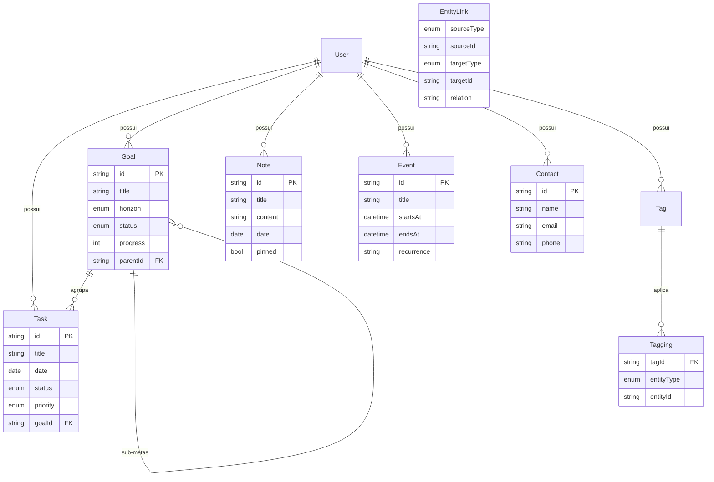

# Modelo de dados

Fonte canônica: [`packages/db/prisma/schema.prisma`](../packages/db/prisma/schema.prisma).
Este documento explica o **porquê** das entidades e, em especial, a camada que
interliga tudo.

## Diagrama (ER)

## Entidades

| Entidade    | Papel                                                             |
| ----------- | ----------------------------------------------------------------- |
| **User**    | Dono dos dados. Já modelado para multi-user (Fase 8).             |
| **Task**    | Atividade de um **dia** (`date`). Eixo central da agenda.         |
| **Goal**    | Meta com progresso e horizonte; suporta sub-metas (auto-relação). |
| **Note**    | Anotação em Markdown, opcionalmente ligada a um dia.              |
| **Event**   | Compromisso com horário, local e recorrência (RRULE).             |
| **Contact** | Pessoa/contato.                                                   |
| **Tag**     | Etiqueta reutilizável aplicável a qualquer entidade.              |

## A camada de integração (o diferencial)

O requisito central é **interligar todas as features**. Isso é resolvido por
dois mecanismos polimórficos — ver [ADR 0003](adr/0003-links-polimorficos.md).

### Tagging (categorização transversal)

`Tagging` associa uma `Tag` a qualquer entidade via o par
`(entityType, entityId)`. Assim, a mesma etiqueta "Projeto X" pode marcar uma
tarefa, uma nota e um contato — agrupando itens de tipos diferentes.

### EntityLink (relações dirigidas entre itens)

`EntityLink` conecta **dois itens quaisquer** com `(sourceType, sourceId)` →
`(targetType, targetId)` e um `relation` opcional. Exemplos:

- `NOTE → CONTACT` ("mencionado")
- `TASK → GOAL` (além do FK natural, para relações ad-hoc)
- `EVENT → CONTACT` (participante)

Por serem polimórficas, essas tabelas **não usam chaves estrangeiras** para o
alvo; a integridade é garantida na camada de serviço da API. O ganho é um
"painel de itens relacionados" uniforme em qualquer tela.

## Eixo do dia

A visão de calendário/agenda agrega, para uma data, tudo cujo campo temporal
cai naquele dia: `Task.date`, `Event.startsAt`, `Note.date` e `Goal.targetDate`.
É o hub que dá sentido diário ao conjunto.
