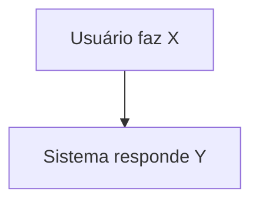

# <Nome da feature> — Fluxos

> Diagramas dos fluxos principais da feature.
> Referência: [README.md](README.md) | [Glossário](../../GLOSSARY.md)

<!--
  Liste os fluxos no índice. Fluxos simples ficam inline (Mermaid abaixo).
  Fluxos complexos ganham um arquivo próprio em flows/<nome>.md.
  Remova estes comentários ao preencher.
-->

## Índice

- <Fluxo 1> — descrição curta.

## <Fluxo 1>

