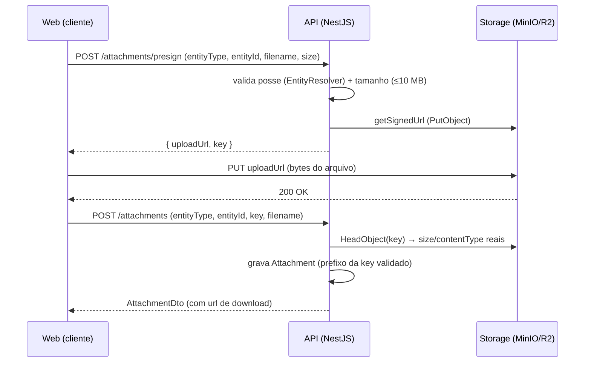
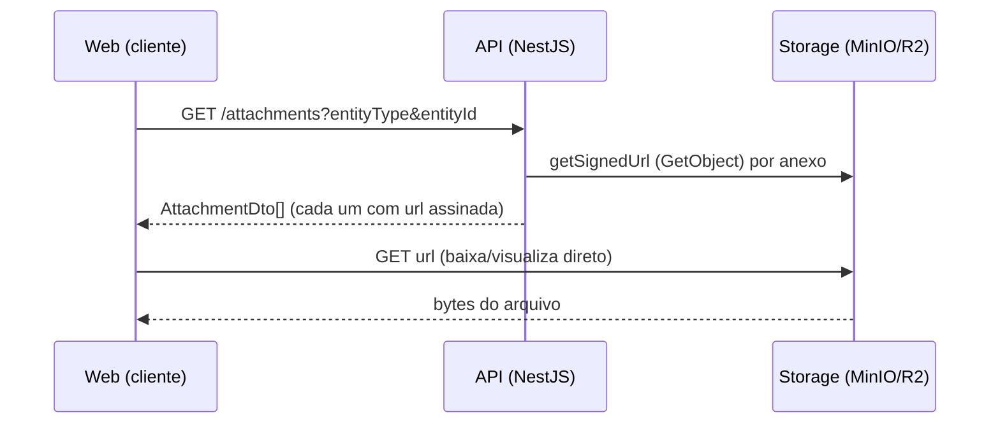

# Anexos — Fluxos

> Referência: [README.md](README.md) | [Glossário](../../GLOSSARY.md#url-assinada)

## Índice

- Upload por URL assinada — presign → PUT direto no storage → registrar.
- Download por URL assinada — listagem devolve URL assinada de GET.

## Upload por URL assinada

## Download por URL assinada

