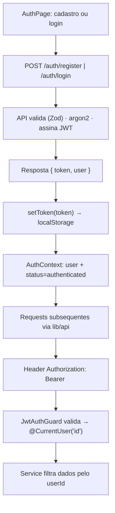
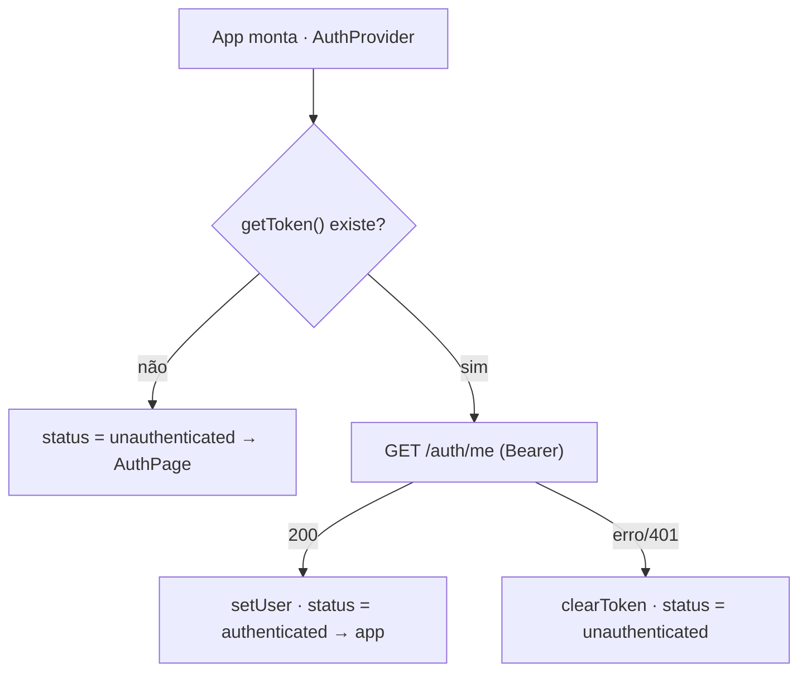
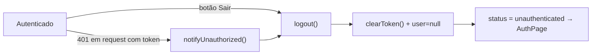

# Autenticação + Perfil — Fluxos

> Referência: [README.md](README.md) | [Glossário](../../GLOSSARY.md#single-user)

## Índice

- Cadastro / login → token no `localStorage` → requests com Bearer.
- Re-hidratação da sessão no boot da web.
- Logout (explícito e por `401` de sessão).

## Cadastro / login e requests autenticados

## Re-hidratação no boot

## Logout (explícito e por sessão expirada)

