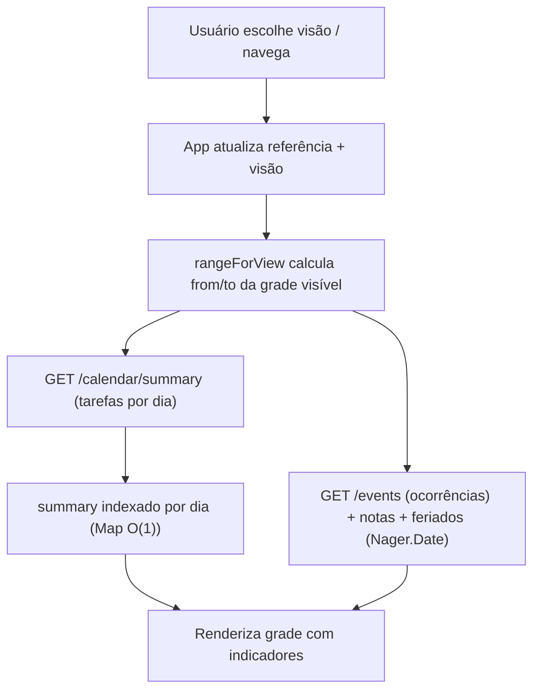
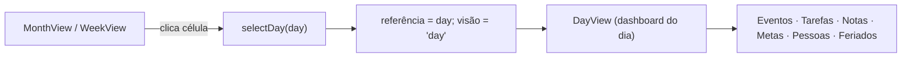
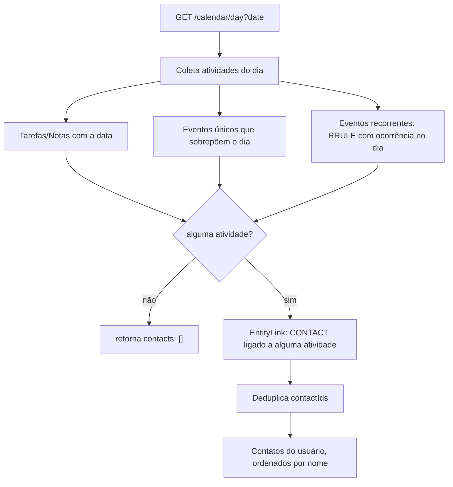

# Calendário / Agenda — Fluxos

> Referência: [README.md](README.md) | [Glossário](../../GLOSSARY.md#resumo-do-dia)

## Índice

- Navegar e renderizar uma visão — referência + intervalo + agregação.
- Clicar um dia abre o dashboard — aprofundamento mês/semana → dia.
- Detalhe do dia (Pessoas do dia) — atividades → `EntityLink` → contatos.

## Navegar e renderizar uma visão

## Clicar um dia abre o dashboard

## Detalhe do dia (Pessoas do dia)

