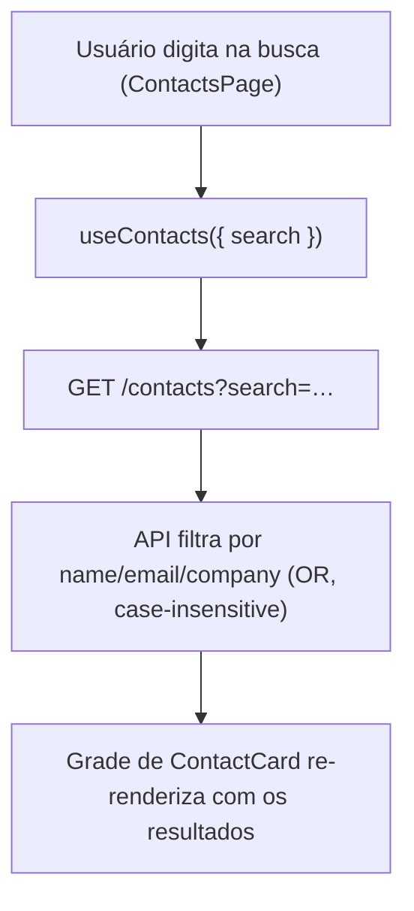
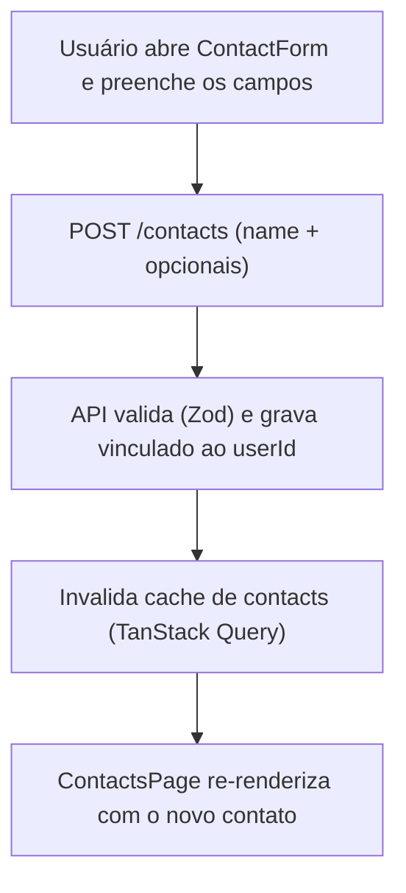

# Contatos — Fluxos

> Referência: [README.md](README.md) | [Glossário](../../GLOSSARY.md#contato)

## Índice

- Buscar contatos — digitação na busca e atualização da grade.
- Criar contato — formulário inline e atualização da lista.

## Buscar contatos

## Criar contato

