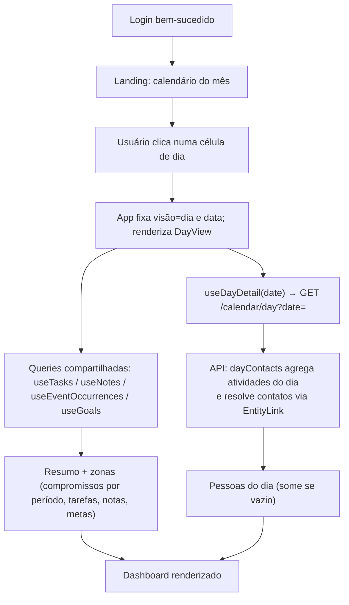
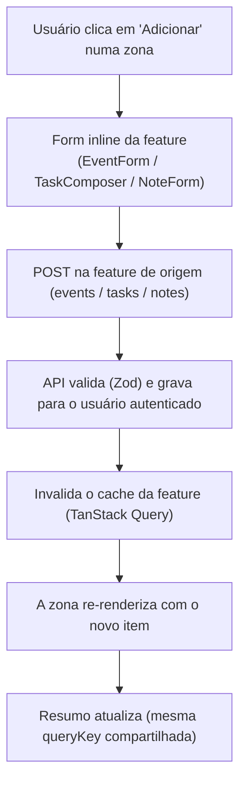

# Dashboard do dia — Fluxos

> Referência: [README.md](README.md) | [Glossário](../../GLOSSARY.md#dia)

## Índice

- Login → calendário → abrir o dashboard de um dia (composição + `GET /calendar/day`).
- Criar um item inline no dashboard (reaproveita o CRUD da feature).

## Login → calendário → dashboard do dia

## Criar item inline no dashboard

