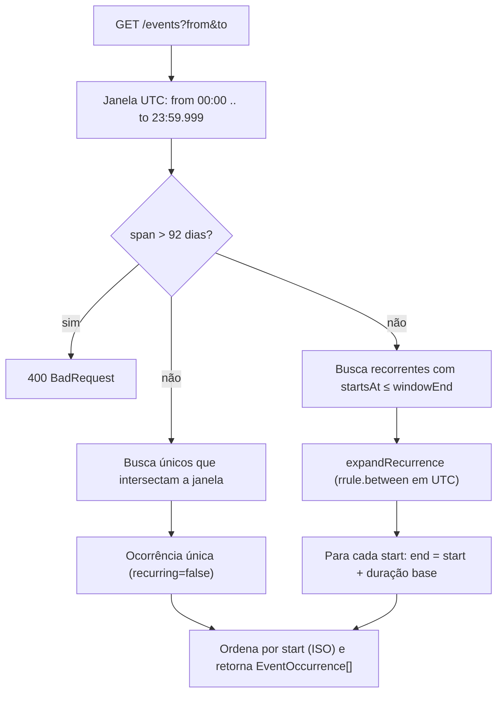
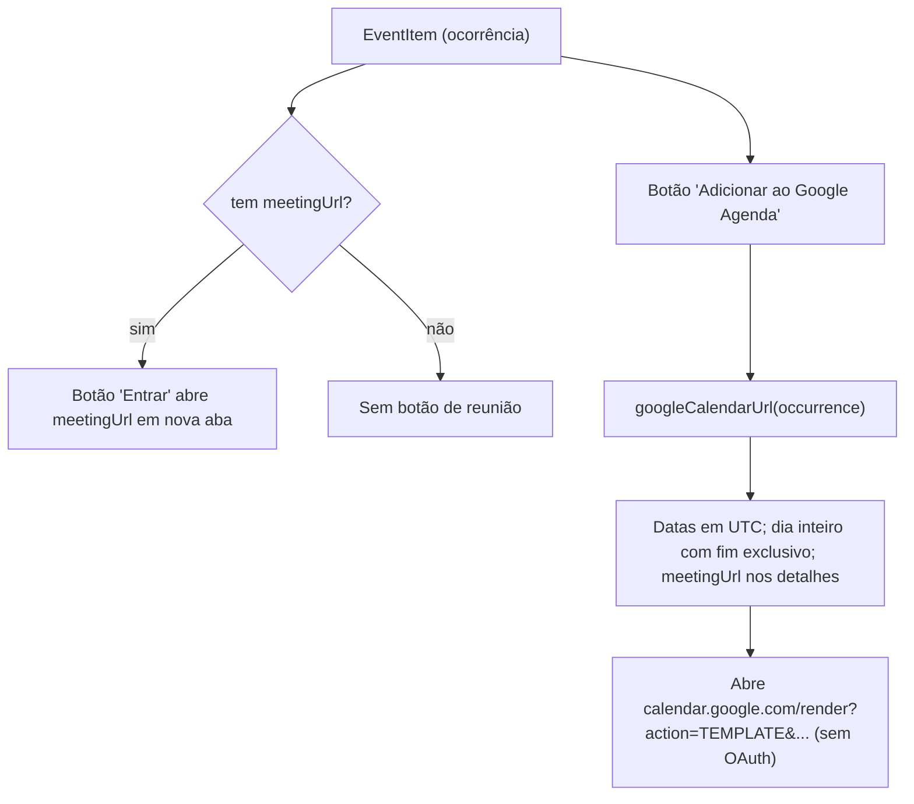

# Compromissos — Fluxos

> Referência: [README.md](README.md) | [Glossário](../../GLOSSARY.md#compromisso)

## Índice

- Expandir ocorrências num intervalo — único vs. recorrente, limite de 92 dias.
- Entrar na reunião / Adicionar ao Google Agenda — integrações leves sem OAuth.

## Expandir ocorrências num intervalo

## Entrar na reunião / Adicionar ao Google Agenda

