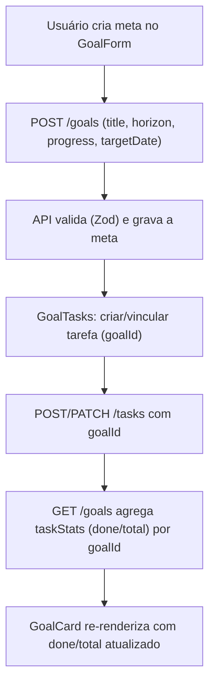
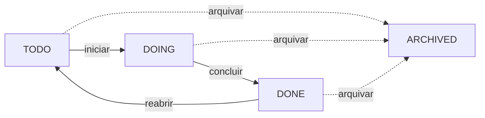

# Metas — Fluxos

> Referência: [README.md](README.md) | [Glossário](../../GLOSSARY.md#meta)

## Índice

- Criar meta e vincular tarefas — progresso (`taskStats`) recalculado na leitura.
- Ciclo de status — A fazer → Em andamento → Concluído (+ arquivar).

## Criar meta → vincular tarefas → progresso recalculado

## Ciclo de status

> `ARCHIVED` é um destino à parte, fora do ciclo do Kanban (A fazer → Em
> andamento → Concluído) e fora das "metas em foco" do dia.
