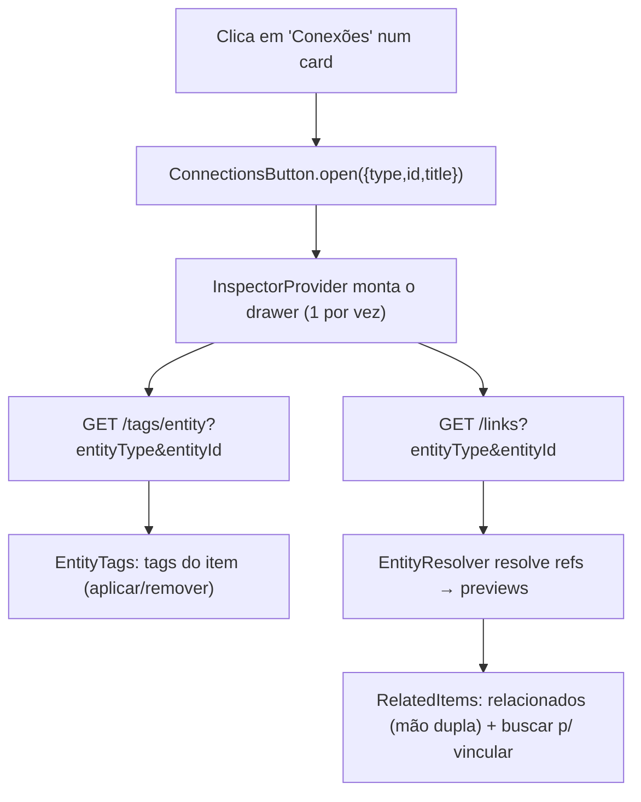
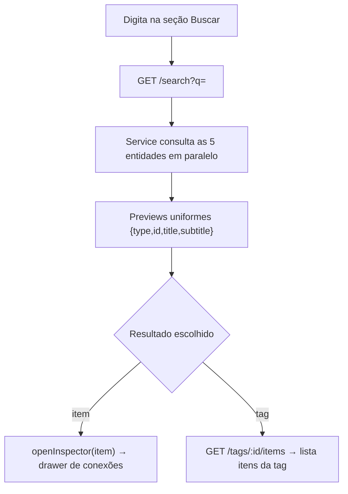
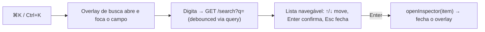

# Integração — Fluxos

> Referência: [README.md](README.md) | [Glossário](../../GLOSSARY.md#inspetor)

## Índice

- Abrir o Inspetor de um card — carrega tags + itens relacionados.
- Busca global → resultado → abre Inspetor (ou navega).
- Command palette (⌘K) — busca em overlay, navegação por teclado.

## Abrir o Inspetor de um card

## Busca global → resultado → Inspetor

## Command palette (⌘K)

