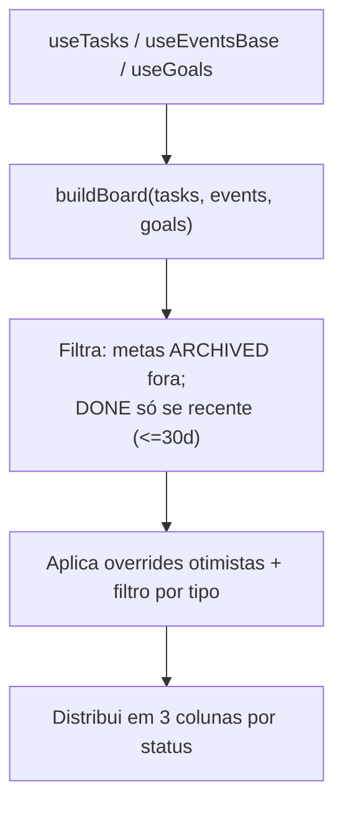
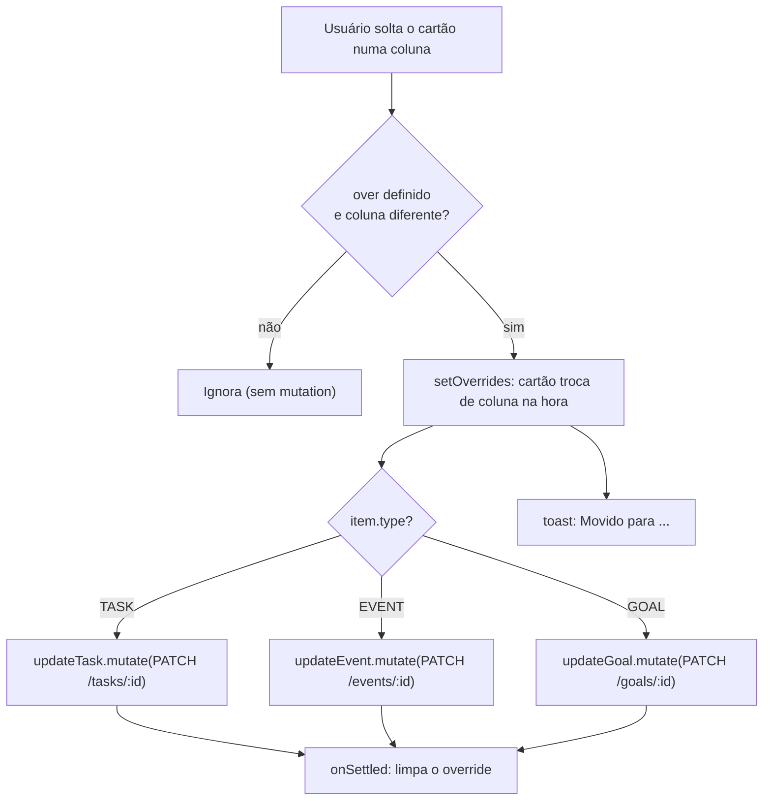

# Kanban — Fluxos

> Referência: [README.md](README.md) | [Glossário](../../GLOSSARY.md#kanban)

## Índice

- Montar o quadro — três fontes normalizadas em `BoardItem`.
- Arrastar cartão entre colunas — update otimista → mutation por tipo → toast.

## Montar o quadro

## Arrastar cartão entre colunas

