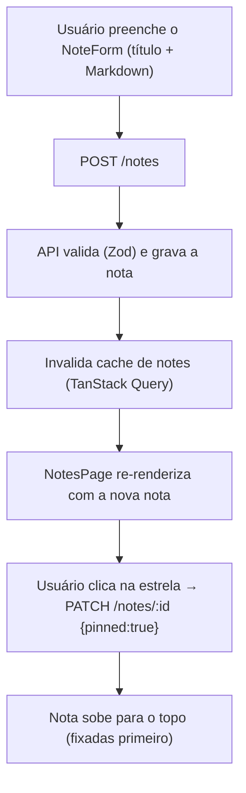

# Anotações — Fluxos

> Referência: [README.md](README.md) | [Glossário](../../GLOSSARY.md#anotacao)

## Índice

- Criar e fixar uma nota — composição, fixar/desafixar e ordenação.
- Anexar a um dia — vínculo via `date` e exibição no dashboard do dia.

## Criar e fixar uma nota



## Anexar a um dia e aparecer no dashboard

```mermaid
flowchart TD
    A["Usuário cria nota com date=YYYY-MM-DD"] --> B["POST /notes (date)"]
    B --> C["API grava date à meia-noite UTC"]
    C --> D["DayNotes consulta GET /notes?date=YYYY-MM-DD"]
    D --> E["Nota aparece na visão de dia, junto de tarefas e compromissos"]
    E -->|PATCH /notes/:id {date:null}| F["Nota desanexada some do dia"]
```
