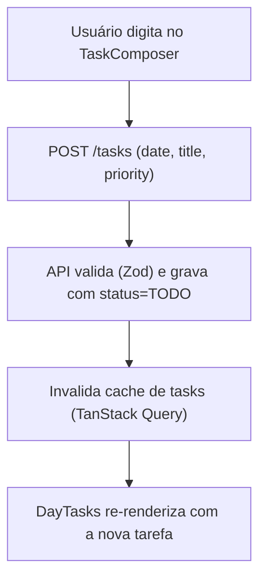
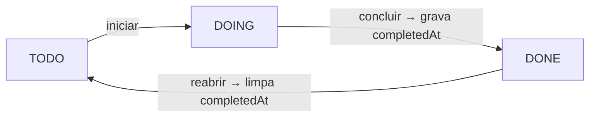

# Tarefas — Fluxos

> Referência: [README.md](README.md) | [Glossário](../../GLOSSARY.md#tarefa)

## Índice

- Criar tarefa no dia — composição inline e atualização da lista.
- Concluir/reabrir — ciclo de status e `completedAt`.

## Criar tarefa no dia

## Concluir / reabrir

